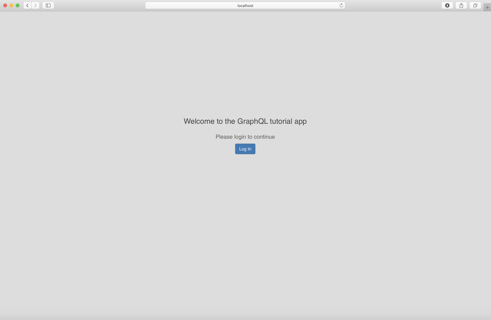
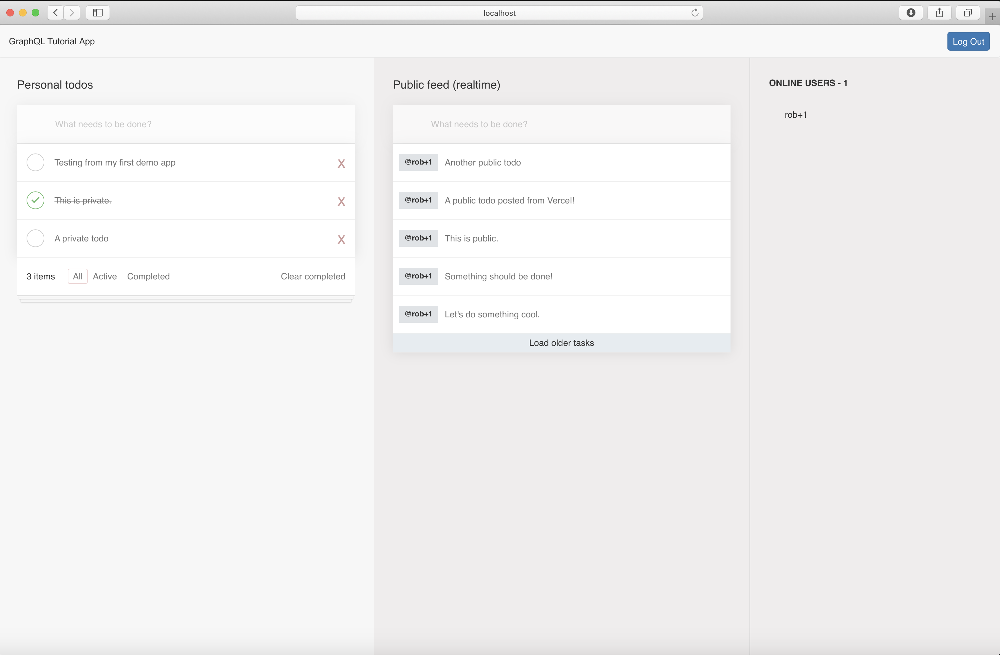

After taking the [tutorial](https://hasura.io/learn/graphql/nextjs-fullstack-serverless) for working with [Hasura](https://hasura.io/), [Auth0](https://auth0.com), [Apollo](https://www.apollographql.com), [Next.js](https://nextjs.org), and [Vercel](https://vercel.com/), I wanted to create a separate project for my own personal refinements and enhancements.

This project is using the app I created in [https://github.com/TheRobBrennan/explore-hasura-apollo-nextjs](https://github.com/TheRobBrennan/explore-hasura-apollo-nextjs) - which is using the [Hasura](https://hasura.io/) server I have configured on [Heroku](https://www.heroku.com/) and connected to my [Auth0](https://auth0.com) tenant.






# Getting started

## Prerequisites

This project assumes you have already configured and deployed a [Hasura back-end](https://github.com/TheRobBrennan/explore-hasura-apollo-nextjs#hasura-backend-setup) to a publicly available URL, as well as [configured Auth0](https://github.com/TheRobBrennan/explore-hasura-apollo-nextjs#auth0-setup) to [connect to your Hasura setup](https://github.com/TheRobBrennan/explore-hasura-apollo-nextjs#connect-hasura-with-auth0).

## Our app

Our [Next.js](https://nextjs.org) application requires you to define several environment variables before it runs.

Please copy `app/.env.example` to `app/.env` and make sure you have defined all the values requested:

```sh
# Application settings
DOMAIN=http://localhost:3000
SESSION_COOKIE_SECRET=BXyv4qDtBKYxJtLopfY7nj75sJg3p2Ka

# Auth0 API
AUTH0_AUDIENCE=

# Auth0 Application
AUTH0_CLIENT_ID=
AUTH0_CLIENT_SECRET=
AUTH0_DOMAIN=

# ------------------------------------------------------ #
#          DO NOT DEFINE THESE IN YOUR .env FILE         #
# ------------------------------------------------------ #
# Define these for each environment in Vercel            #
# ------------------------------------------------------ #
# GRAPHQL_HTTPS_ENDPOINT=https://explore-hasura-apollo-nextjs.herokuapp.com/v1/graphql
# GRAPHQL_WSS_ENDPOINT=wss://explore-hasura-apollo-nextjs.herokuapp.com/v1/graphql
# POST_LOGOUT_REDIRECT_URI=http://localhost:3000/
# REDIRECT_URI=http://localhost:3000/api/callback
# ------------------------------------------------------ #
```

### Start the application

To run the [Next.js](https://nextjs.org), be sure to navigate to the `app` directory, install all of the dependencies, and then run the app:

```sh
$ cd app
$ npm install

# To run Next.js in development mode
$ npm run dev

# To run Next.js as a production server
$ npm start
```

If you have defined your environment variables correctly, your app should be running at [http://localhost:3000](http://localhost:3000) - allowing you to log in and log out using [Auth0](https://auth0.com) for authentication.

**PRO TIP** Once you have installed your dependencies, you can simply run `npm start` from the root level of this project.

# Deployment

## Vercel

This project is using [Vercel](https://vercel.com/) to deploy the front-end code as well the serverless back-end API functions contained within our [Next.js](https://nextjs.org) app.

This project has been configured to automatically deploy to [Vercel](https://vercel.com/) - available at [https://demo-hasura-nextjs-vercel-with-bootstrap.vercel.app](https://demo-hasura-nextjs-vercel-with-bootstrap.vercel.app) - using the [Vercel for GitHub](https://vercel.com/github) integration once code has been merged into `master`

**PRO TIP** Don't forget to enable GitHub integration for your project on [Vercel](https://vercel.com/) as well as give permission to the [Vercel for GitHub](https://vercel.com/github) integration on your account, otherwise this automatic deployment will not work 🤓

To manually deploy to [Vercel](https://vercel.com/) to a preview or staging URL, you can run `npm run deploy`
To manually deploy to [Vercel](https://vercel.com/) and immediately replace the current production site, you can run `npm run deploy:prod`

### Initial setup and configuration

If you are deploying this project to [Vercel](https://vercel.com/) for the first time, when you run `npm run deploy` you will be prompted as follows.

You can accept most of the defaults as is; however please pay special attention to:

- `Which scope do you want to deploy to?` - If you do not have an account on Vercel, you may be prompted to create one.
- `In which directory is your code located?` - This needs to

```sh
$ npm run deploy

Vercel CLI 19.1.1
? Set up and deploy “~/repos/demo-hasura-nextjs-vercel-with-bootstrap”? [Y/n] Y
? Which scope do you want to deploy to? TheRobBrennan
? Link to existing project? [y/N] n
? What’s your project’s name? demo-hasura-nextjs-vercel-with-bootstrap
? In which directory is your code located? ./app
Auto-detected project settings (Next.js):
- Build Command: `npm run build` or `next build`
- Output Directory: Next.js default
- Development Command: next dev --port $PORT
? Want to override the settings? [y/N] n
🔗  Linked to therobbrennan/demo-hasura-nextjs-vercel-with-bootstrap (created .vercel and added it to .gitignore)
🔍  Inspect: https://vercel.com/therobbrennan/demo-hasura-nextjs-vercel-with-bootstrap/dx4tnv5ty [2s]
✅  Production: https://demo-hasura-nextjs-vercel-with-bootstrap.vercel.app [copied to clipboard] [49s]
📝  Deployed to production. Run `vercel --prod` to overwrite later (https://vercel.link/2F).
💡  To change the domain or build command, go to https://zeit.co/therobbrennan/demo-hasura-nextjs-vercel-with-bootstrap/settings
```

#### Secrets

I have chosen to use the `dhnvwb` prefix for all of my secrets, but it is just personal preference due to the number of projects I have.

You will need to define the following secrets:

```sh
$ vercel secrets add dhnvwb-auth0-domain <YOUR_AUTH0_DOMAIN>                            // myapp.us.auth0.com
$ vercel secrets add dhnvwb-auth0-audience <YOUR_AUTH0_AUDIENCE_URL>                    // https://myapp.us.auth0.com/api/v2/
$ vercel secrets add dhnvwb-auth0-client-id <YOUR_AUTH0_CLIENT_ID>                      // See your Auth0 Application settings
$ vercel secrets add dhnvwb-auth0-client-secret <YOUR_AUTH0_CLIENT_SECRET>              // See your Auth0 Application settings
$ vercel secrets add dhnvwb-redirect-uri <YOUR_REDIRECT_URI>                            // https://myapp.vercel.app/api/callback
$ vercel secrets add dhnvwb-post-logout-redirect-uri <YOUR_POST_LOGOUT_REDIRECT_URI>    // https://myapp.vercel.app
$ vercel secrets add dhnvwb-session-cookie-secret <YOUR_COOKIE_SECRET>                  // Random 32 character string
```

### Environments

This project has been configured on [Vercel](https://vercel.com/) so that manually deployed code - using `npm run deploy` or `npm run deploy:dev` - will redirect to the appropriate environments.

For this to happen, the following environment variables need to be defined in the [Vercel](https://vercel.com/) UI for `Production` and `Preview` environments:

- GRAPHQL_HTTPS_ENDPOINT
- GRAPHQL_WSS_ENDPOINT
- POST_LOGOUT_REDIRECT_URI
- REDIRECT_URI

If you would like to have other variables explicitly set for these environments, please make sure they are declared in both places and that they do not appear in our [Vercel](https://vercel.com/) configuration file `app/vercel.json`

#### Preview

This will enable users to log in and authenticate using the `preview` URL of [https://demo-hasura-nextjs-vercel-with-bootstrap.therobbrennan.vercel.app](https://demo-hasura-nextjs-vercel-with-bootstrap.therobbrennan.vercel.app)

#### Production

This will enable users to log in and authenticate using the `production` URL of [https://demo-hasura-nextjs-vercel-with-bootstrap.vercel.app](https://demo-hasura-nextjs-vercel-with-bootstrap.vercel.app)
